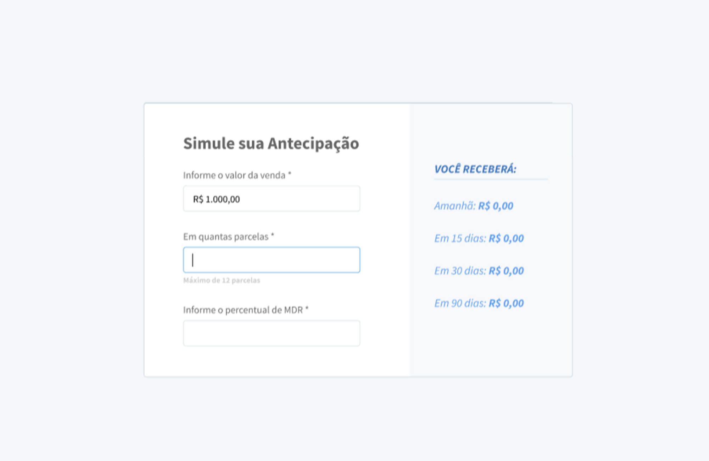

<h1 align="center">
    Desafio FrontEnd Kenzie
</h1>

## 💻 Sobre o desafio

Hoje nossos clientes precisam saber quanto custa antecipar uma transação, e para isso, precisamos desenvolver uma calculadora de antecipação para que os mesmos consigam saber quais valores receberão caso optem por antecipar o recebimento.

O objetivo era desenvolver o teste seguindo os requisitos abaixo.

### **Requisitos**

- Use componentização.
- Os períodos de recebimento devem ser configuráveis já que a API pode receber uma lista de periódos para realizar os cálculos.

### **Extra**

Lembrando que extra não é obrigatório, mas seria um diferencial a implementação.

- Faça testes unitários e/ou de ponta-a-ponta (end-to-end)

Os possíveis cenários devem ser cobertos e terem soluções implementadas. Não foi desenvolvido layout para isso, pois queremos observar como você lidará com eles:

- Demora de respostas da API
- Timeout da API
- Conexão lenta
- Usuário estar offline


Projeto desenvolvido durante o curso de **Desenvolvimento FullStack** oferecido pela [Kenzie Academy Brasil](https://kenzie.com.br/). A Kenzie é uma escola de programação com um ensino de qualidade que capacita seus aluno para se tornarem desenvolvedores FullStack em 12 meses!


## 🎨 Layout

O layout proposto para essa calculadora pode ser visto na imagem abaixo.

<p align="center">
  
</p>

## 🛠 Tecnologias

As seguintes ferramentas foram usadas na construção do projeto:

- [Javascript]()
- [React]()
- [Typescript]()
- [Git]()
- [Github]()

## 🚀 Como executar o projeto

### Pré-requisitos

Antes de começar, você vai precisar ter instalado o [Git](https://git-scm.com) em sua máquina. 
Além disto é bom ter um editor para trabalhar com o código como [VSCode][vscode]

### 🧭 Rodando a aplicação web localmente na sua máquina (Front End)

```bash
# Clone este repositório
$ git clone https://github.com/patrickcordeiroestudos/desafio-frontend-kenzie.git

# Acesse a pasta do projeto no seu terminal/cmd
$ cd desafio-frontend-kenzie

# Instale as dependências
$ yarn

# Execute a aplicação em modo de desenvolvimento
$ yarn start

# A aplicação será aberta na porta:3000 - acesse http://localhost:3000
```

## 😯 Como contribuir para o projeto

1. Faça um **fork** do projeto.
2. Crie uma nova branch com as suas alterações: `git checkout -b my-feature`
3. Salve as alterações e crie uma mensagem de commit contando o que você fez: `git commit -m "feature: My new feature"`
4. Envie as suas alterações: `git push origin my-feature`
> Caso tenha alguma dúvida confira este [guia de como contribuir no GitHub](https://github.com/firstcontributions/first-contributions)

## 📝 Licença

Este projeto esta sob a licença MIT.

Feito com ❤️ por Patrick Cordeiro 👋🏽 [Entre em contato!](https://www.linkedin.com/in/patrickcordeiro/)
